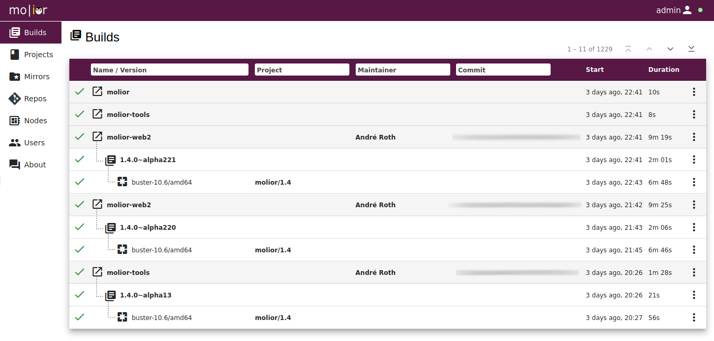
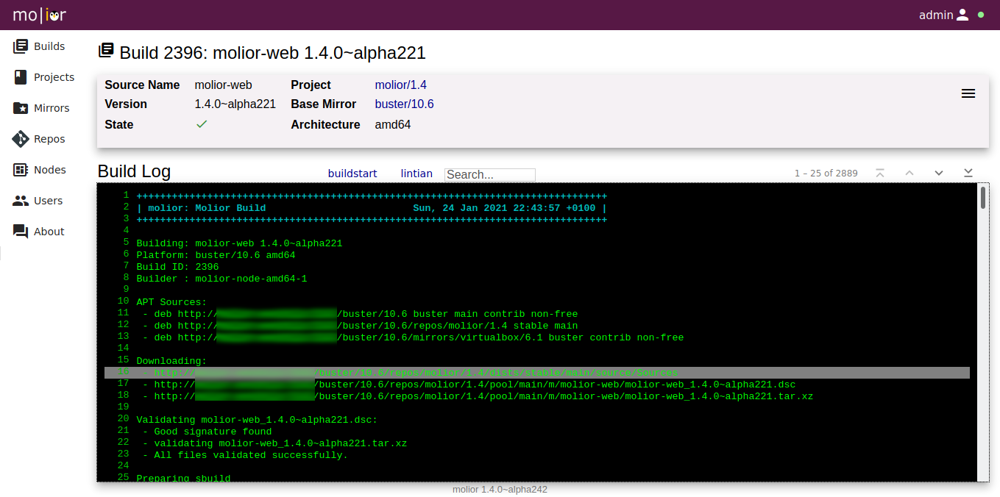
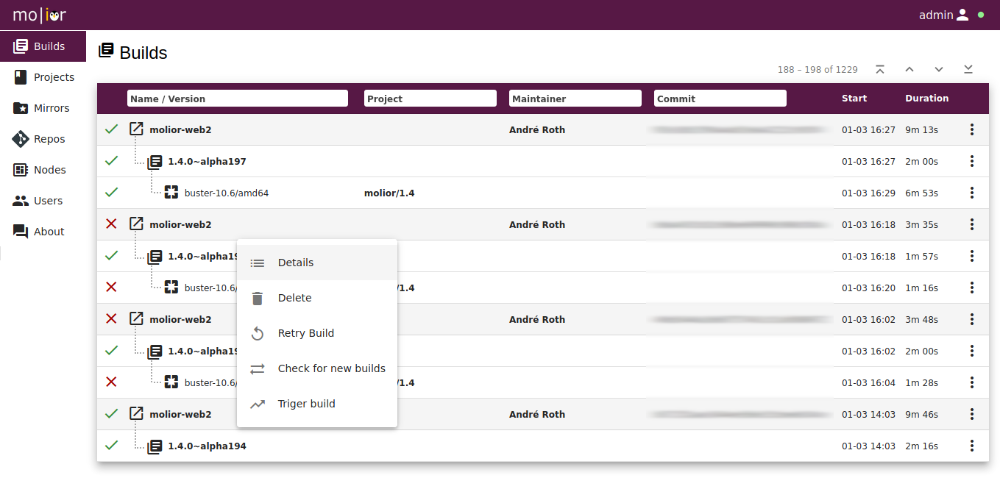
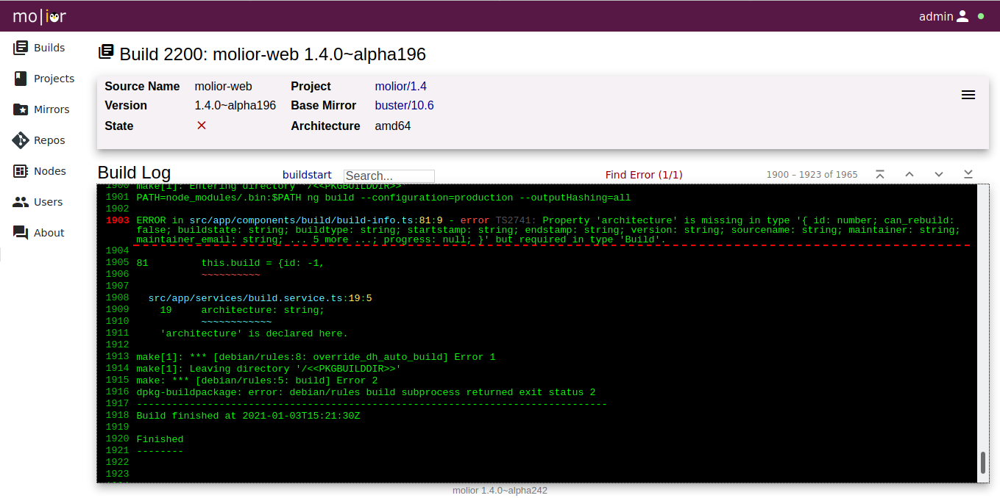
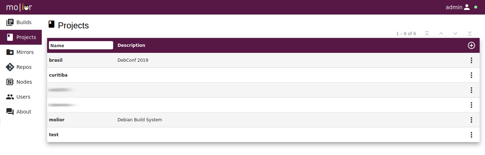
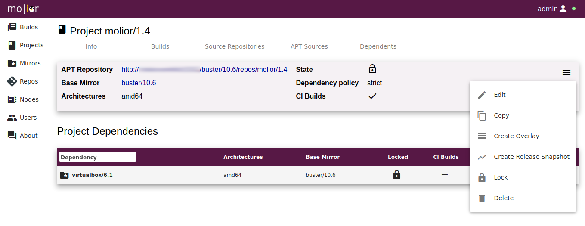
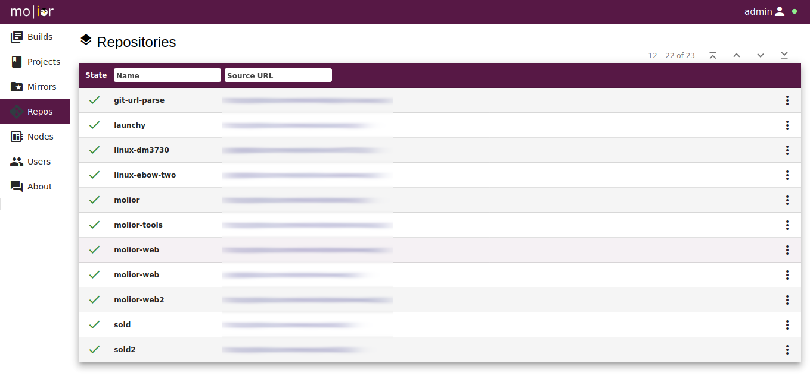
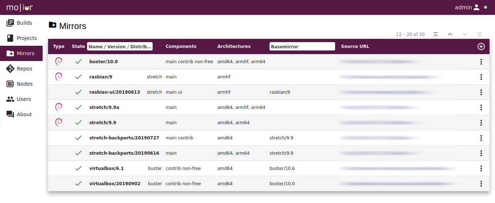

<div align="center"><p>Debian Build System</p></div>

# About

Molior is based on [aptly](https://www.aptly.info) for managing Debian package repositories and [sbuild](https://wiki.debian.org/sbuild) for building Debian packages on multiple distributions and architectures.

Molior allows the following via WebUI, REST API or commandline tools:

* Manage Debian repository mirrors
* Manage Debian repositories grouped in projects and versions
* Manage project dependencies between base mirrors and other projects
* Provide build nodes (amd64, arm64) on VMs or bare metal for running sbuild
* Build debianized git repositories for multiple projects and architectures (i386, amd64, armhf, arm64)
* Create project deployments (ISO Installers, VM images, containers, ...)

# Table of content
<!-- vim-markdown-toc GFM -->

* [Screenshots](#screenshots)
* [Installation](#installation)
* [Components](#components)
* [Usage](#usage)
    * [Login to the Web UI](#login-to-the-web-ui)
    * [Creating Mirrors](#creating-mirrors)
        * [Use apt-cacher-ng (optional)](#use-apt-cacher-ng-optional)
        * [Debian base mirror](#debian-base-mirror)
    * [Create a project](#create-a-project)
    * [Add a source repo](#add-a-source-repo)
    * [Create a non-base mirror (optional)](#create-a-non-base-mirror-optional)
    * [Integration](#integration)
        * [Trigger builds from gitlab](#trigger-builds-from-gitlab)
        * [Build notification hooks](#build-notification-hooks)
* [Contributing](#contributing)
    * [Clone the source repositories](#clone-the-source-repositories)
    * [Login to the Web UI](#login-to-the-web-ui-1)
    * [Build molior](#build-molior)
    * [Demo Project](#demo-project)
    * [Watch the logs](#watch-the-logs)
    * [Toubleshooting](#toubleshooting)
* [Authors](#authors)

<!-- vim-markdown-toc -->

# Screenshots

<div>
  <h3>Build List</h3>
  
  <h3>Build Log</h3>
  
  <h3>Build Context Menu</h3>
  
  <h3>Build Errors</h3>
  
  <h3>Molior Project List</h3>
  
  <h3>Molior Project / Context Menu</h3>
  
  <h3>Git Repositories</h3>
  
  <h3>APT Repository Mirrors</h3>
  
  <h3>Build Nodes</h3>
  
</div>

# Installation

See [INSTALL.md](INSTALL.md).

# Components

The molior Debian Build System consists of the following components:

- molior-server
  - based on aiohttp
  - manages git repositories
  - manages project and versions
  - manages Debien repositories (aptly)
  - creates Debian source packages
  - provides REST API
  - provides build and deployment environments (schroot, debootstrap)
  - uses aptly REST API
  - uses PostgreSQL database
- molior-web
  - based on AngularJS, nodejs
  - uses molior REST API
- aptly
  - see http://aptly.info
  - manages Debian repository mirrors
  - manages Debian project repositories
  - provides REST API
  - contains molior specific API improvements
- molior-client
  - based on aiohttp
  - runs on build nodes
  - uses molior REST API
  - uses build environment
- molior-tools
  - create releases
  - create deployments
  - automation scripts


# Usage

## Login to the Web UI

Point your browser to the URL of the molior server, login with admin and the password defined in /etc/molior/molior/yml.

## Creating Mirrors

### Use apt-cacher-ng (optional)

Install apt-cacher-ng in order to speed up mirroring.

For mirroring stretch, you might want to add the following to /etc/apt-cacher-ng/acng.conf:
```
PfilePatternEx: \.asc$
```

### Debian base mirror

The following will mirror Debian/stretch for amd64 and arm64. It will take approx. 73GB of disk space.

- Click on Mirror, New Mirror
- Name: stretch
- Version: 9.9
- Continue
- Check: Basemirror
- UnCheck: Mirror Source
- Uncheck: Mirror Installer
- Distribution: stretch
- Select Architectures: amd64, arm64
- Components: main
- Source: http://httpredir.debian.org/debian (or use apt-cacher-ng URL)
- Select: Use Mirror Key
- Continue
- Add the keys (separately): EF0F382A1A7B6500 8B48AD6246925553 7638D0442B90D010 04EE7237B7D453EC
- Key Server: hkp://keyserver.ubuntu.com:80
- Confirm

Depending on the network and disk performance, this might take a 2-3 hours.

Note: if you are mirroring Debian/buster use these keys: 04EE7237B7D453EC 648ACFD622F3D138 DCC9EFBF77E11517)

## Create a project


- Name: test
- Click new
- Project Version: 1.0
- Choose base mirror
- Choose amd64, arm64 arhcitecutres

## Add a source repo

- Click project: test
- Click project version: 1.0
- Click Repositories
- Click NEW REPOSITORY
- URL: https://github.com/neolynx/sold.git
- Click Continue
- Click Continue

## Create a non-base mirror (optional)

Molior can create mirror of APT repositories, for example mono:

```
Name: mono
Version: 5.2
Dist: stretch
Archs: amd64
Source: http://download.mono-project.com/repo/debian
Keys: 3FA7E0328081BFF6A14DA29AA6A19B38D3D831EF
Key Server: hkp://keyserver.ubuntu.com:80
```

or Docker:

```
Name: docker
Version: 17.09
Dist: stretch
Archs: amd64
Mirror source packages: no
Base mirror: no
Components: stable
Source: https://download.docker.com/linux/debian
Key URL: https://download.docker.com/linux/debian/gpg
```


## Integration

### Trigger builds from gitlab

In GitLab:
- Go to Settings/Integrations (or Administration/System-Hooks)
- Enter URL: http://moliorserver/api/build/gitlab (replace with your molior instance)
- Choose secret token id authenticated triggers are desired
  - Configure secret token in /etc/molior/molior/yml (gitlab/auth_token)
- Select "Push events" if CI builds are desired
- Select "Tag push events"

### Build notification hooks

Molior can trigger a REST API when build states change.

```
    POST https://remoteserver/api/{{build.commit|urlencode}}

    {
        "key":"molior-{{platform.distrelease}}-{{platform.version}}-{{platform.architecture}}-{{project.name}}-{{project.version}}",

        "name":"Molior {{platform.architecture}} / {{platform.version}} / {{platform.distrelease}} Build for {{build.commit}}",
        
        "state":"INPROGRESS",
        
        "state":"SUCCESSFUL",
        
        "state":"FAILED",
        
        "description":"{{build.status}}",
        "url":"{{build.url}}"
    }
```

# Contributing

You are welcome to contribute to the project !

- Feel free to open issues with questions, suggestions and improvements
- Pull requests are welcome, please consider the following:
    - Follow the rules of [PEP8](http://legacy.python.org/dev/peps/pep-0008/)
    - Use [Google docstrings](http://sphinxcontrib-napoleon.readthedocs.io/en/latest/example_google.html). (for automated docs generation)
    - Make changes backward compatible and upgradeable (especially the database changes)
    - Unit test the changes, whenever possible

The following chapters describe how to setup a development environment.
For building Debian packages in molior, the creation of a Debian mirror is required. This needs approximately 80GB of free disk space.

## Clone the source repositories

The following source respositories are needed:

```shell
mkdir molior-dev
cd molior-dev
git clone https://github.com/molior-dbs/molior.git
git clone https://github.com/molior-dbs/molior-web.git
git clone https://github.com/molior-dbs/aptlydeb.git

git clone https://github.com/neolynx/launchy.git
git clone https://github.com/neolynx/cirrina.git
git clone https://github.com/neolynx/aiohttp_jrpc.git
git clone https://github.com/neolynx/aiohttp-session.git
git clone https://github.com/neolynx/aiohttp-swagger.git

cd aptlydeb
git submodule init
git submodule update
cd ..
```

## Login to the Web UI

Username: admin
Password: see /etc/molior/molior.yml

## Build molior

The following command will build all molior components:
```
build
```

Alternatively the components can be built individually:
```
build molior-web # or molior, aptlydeb
```

## Demo Project
```
git clone https://github.com/molior-dbs/curitiba.git
```

## Watch the logs
```
log
```

## Toubleshooting

See output of aptly tasks:
```
wget -O- -q http://localhost:8000/api/tasks/11/output
```

# Authors

- André Roth
- Benjamin Fassbind
