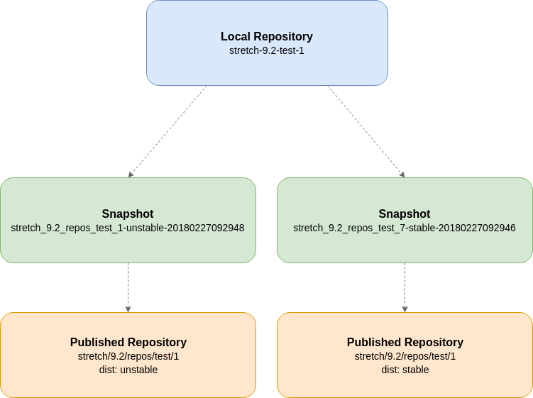
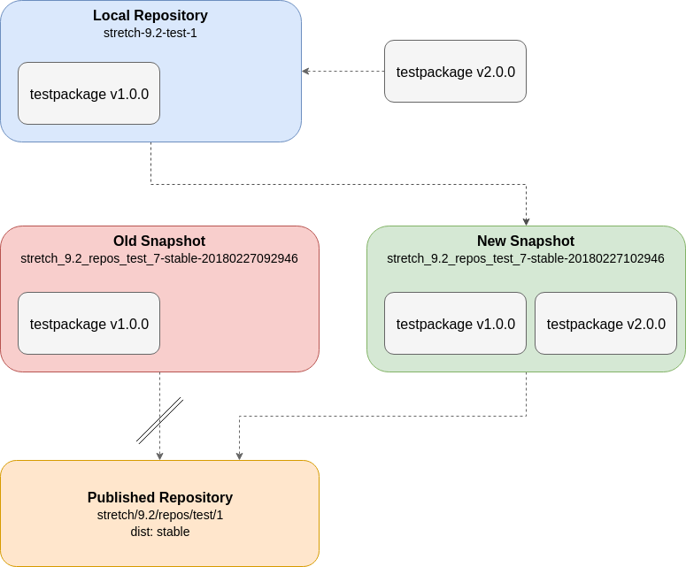

Publish Workflow
================

Local Repository
~~~~~~~~~~~~~~~~

For each Project Version an Aptly 'Local Repository' is created. All packages (Continuous Integration and Release) of the corresponding Project Version
are pushed to this repository.

**Naming convention**

``{distrelease}-{distrelease_version}-{project}-{projectversion}``

Example: stretch-9.2-test-1

Snapshot
~~~~~~~~

To split up the Release and Continuous Integration packages Aptly Snapshots are used.

**Naming convention**

``{distrelease}_{distrelease_version}_repos_{project}_{projectversion}-{dist}-{timestamp}``

or

``{publish_name}-{dist}-{timestamp}``

Example: stretch_9.2_repos_test_1_unstable-20180227092948

The `{dist}` parameter in this case can be 'stable' or 'unstable' for example.

Published Repository
~~~~~~~~~~~~~~~~~~~~

The published Repository is the final endpoint which can be accessed by the users.

**Naming convention**

Aptly command line interface

``{distrelease}/{distrelease_version}/repos/{project}/{projectversion}``

or (for aptly api normalized)

``{distrelease}_{distrelease_version}_repos_{project}_{projectversion}``

Additionally the {dist} (e.g. stable, unstable) is passed to the api to publish two snapshots on the same publish point (and pool)
but on different distributions.

More information on how the different aptly entities work can be found in the official documentation:
https://www.aptly.info/doc/overview/

Publish Workflow Example
~~~~~~~~~~~~~~~~~~~~~~~~

1. Add ``testpackage v2.0.0`` to local repository ``stretch-9.2-test-1``
2. Create new snapshot of local repository ``stretch-9.2-test-1`` including all ``stable`` packages
3. Switch published old snapshot with the newly created one.
4. Delete old snapshot
