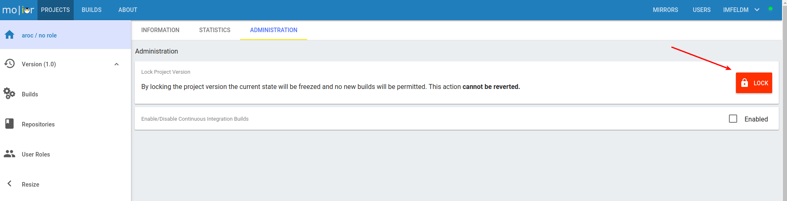
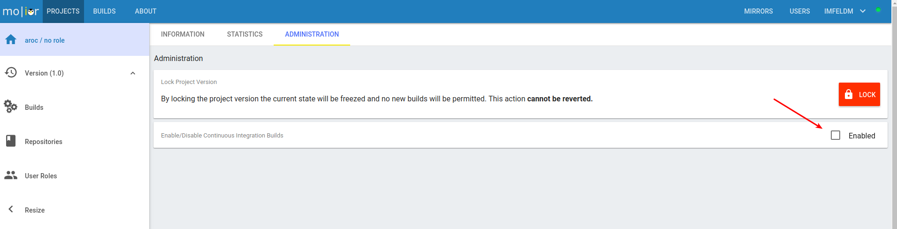

Projects and Project Versions
=============================

Project
-------
A project develops a life cycle of software components and can have one or more project versions.

Project Version
---------------
A project version provides a set of software components which are developed and released together. For production release
project versions can be freezed so no further changes to it will be allowed by molior.

Project versions are always based on a specific base mirror to ensure repeatable builds.
Therefore you'll have to first select a base mirror when creating a project version. Furthermore you can define which
architectures should be allowed for this project version. When adding source repositories later on you will only be able to choose
architectures out of this selection.

**Changes to projects/versions can only be done manually by an administrator.**

Dependencies
^^^^^^^^^^^^

Dependencies can be selected while creating a new project version. To guarantee consistency molior only lets you select the ones which have the **same base** as selected in the creation window.
This means if your project version which you are creating should be based on stretch 9.4 for example you can only select other project versions and framework mirrors as dependencies which also are built on top of stretch 9.4.

Locking/Freezing
^^^^^^^^^^^^^^^^

Project Versions can be locked/freezed after production release to ensure that no new packages will be built and published in this version.
This can be done in the **Administration** tab of the project version.

Continuous Integration Builds
^^^^^^^^^^^^^^^^^^^^^^^^^^^^^
Continuous Integration builds can be enabled/disabled per project version. This can be done in the **Administration** tab of the project version.
If CI-Builds are enabled molior will schedule a build on every git push. Keep in mind that the built packages will be published to
the ``unstable`` apt repository.

